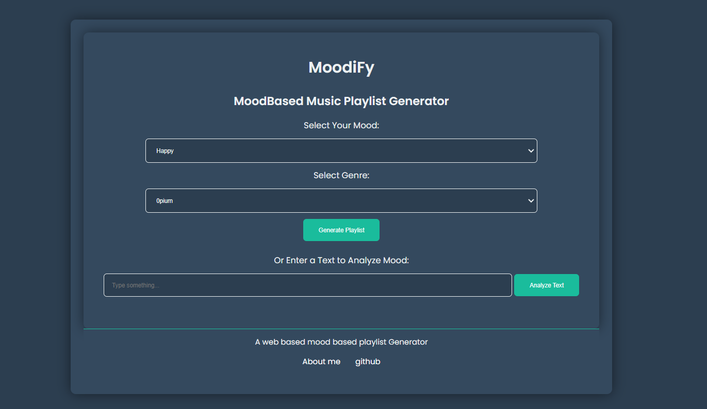

# Mood-Based Music Playlist Generator

Welcome to the Mood-Based Music Playlist Generator! This web application helps you discover music that matches your mood by generating curated playlists based on your current emotional state and preferred music genre.

## Features
- Mood-Based Playlists: Choose your mood from options like Happy, Sad, Energetic, and Calm to receive a tailored playlist.
- Genre Filtering: Filter playlists by genre, including Pop, Rock, Hip-Hop, Classical, and more.
- Text Analysis: Enter a text to analyze its sentiment and get a mood-based playlist suggestion.
- User-Friendly Interface: Enjoy a clean, intuitive design with responsive layout and easy navigation.

## Demo



## Getting Started
### Prerequisites
- Web browser (e.g., Chrome, Firefox, Safari)
- Basic knowledge of HTML, CSS, and JavaScript


### Installation
1. Clone the Repository
```
git clone https://github.com/yourusername/mood-based-playlist-generator.git
```
2. Navigate to the Project Directory
```
cd mood-based-playlist-generator
```
3. Open the index.html File
Open index.html in your preferred web browser to view the application.

## Usage
1. Select Your Mood: Choose from Happy, Sad, Energetic, or Calm.
2. Choose a Genre: Select a genre from the available options.
3. Generate Playlist: Click the "Generate Playlist" button to see a list of songs based on your selections.
4. Analyze Text: Alternatively, enter a text to analyze its mood and get a corresponding playlist.

## Customization
You can easily add more genres or moods by updating the options in the index.html file and the playlist data in script.js. For adding new styles or modifying existing ones, update the style.css file.

## Contributing
If you’d like to contribute to this project, please fork the repository, make your changes, and submit a pull request. Contributions and feedback are always welcome!

## License
This project is licensed under the MIT License - see the LICENSE file for details.

## Contact
For any questions or issues, please contact amitdey1350@gmail.com

<a href="https://amitfr.tech">My protfolio<a>